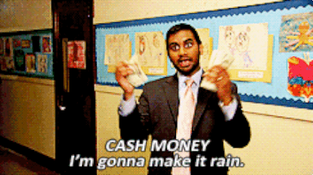
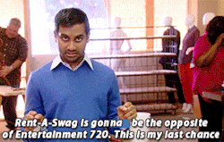
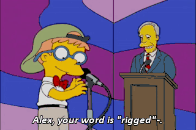
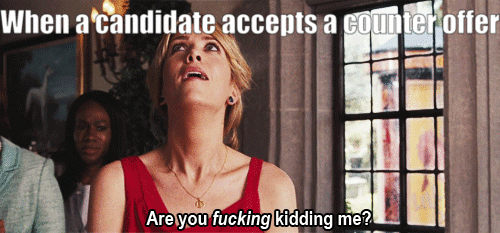
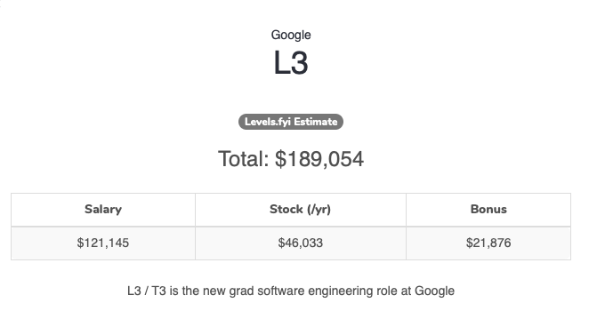
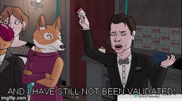

export { default as theme } from './src/theme'
import Emoji from './src/emoji';
import TallImage from './src/tall-image';
import AboutMe from './src/about-me';
import { Appear, Image, Notes } from 'mdx-deck'
import {darkGreen} from './src/colors';

import { Head } from 'mdx-deck'

<Head>
  <title>Chose Your Own Adventure</title>
</Head>

# Chose Your Own Adventure
---
<AboutMe />
<Notes>
  <ul>
    <li>The console log is a weekly podcast about frontend news, we make puns</li>
    <li>Follow me on twitter, it validates me</li>
  </ul>
</Notes>
---

# What are we gonna talk about?
<ul>
  <Appear>
    <li>Lifespan of a tech company</li>
    <li>Increasing Your Own Value</li>
    <li>Negotiating</li>
  </Appear>
</ul>
---
# Lifespan of a tech company

---

Idea gif
<Notes>
  Who had the idea? 
  Travis Kalanik might not have great intentions
  Bill Gates usually does
  Steve Jobs only ccared about shipping products
  Evan Speigal
</Notes>

---

Company Builds MVP
<Notes>
  Either they do it out of pocket or they get initial funding or they convince some poor soul to do it for cheap.
</Notes>

---

# Startup Funding

<ul>
  <li>🙅‍♀️ Seed</li>
  <li>🤷‍♀️ Series A</li>
  <li>💁‍♀️ Series B+</li>
</ul>

---
# 🙅‍♀️ Seed

<Notes>
  <ul>
    <li>They've taken less than 1 million in funding </li>
    <li>They're just trying to find product/market fit</li>
    <li>Constantly going to have existential crises, means you dont know your job will be there in a year</li>
    <li>Don't do this unless you know what you're doing</li>
    <li>You will be expected to be the senior engineer</li>    
  </ul>
</Notes>
---
# 🤷‍♀️ Series A

<Notes>
  <ul>
    <li>They've taken tens of millions in funding </li>
    <li>They should know what their product is doing and just need time + resources to get there</li>    
    <li>Should have a real business plan</li>
    <li>10+ employees</li>
    <li>Your job will be there in a year, not much more</li>
  </ul>
</Notes>
---
# 💁‍♀️ Series B+

<Notes>
  <ul>
    <li>Hopefully they've taken about 100 million in funding</li>
    <li>Will likely be around 2-3 more years</li>
    <li>50+ employees</li>
    <li>Check out angellist for their history</li>
    <li>Series d+ better be a major company otherwise they're just diluting shares</li>
  </ul>
</Notes>
---
# Public Company
<Notes>
  * Make Shareholders happy
  * Don't get sued
  * Constantly trying to prove growth, sometimes they do this through acquisitions.
</Notes>
---
# Pivoting

<Notes>
  Fates Forever -> Discord
  Dating Service -> YouTube
  Odeo -> Twitter
</Notes>

---

# Increasing Your Own value
---

# What are you optimizing for?

  <ul>
    <Appear>
      <li>Money</li>
      <li>👩‍🏫 Learning</li>
      <li>🚴‍♀️Work Life/Balance</li>
      <li>🏙 Location</li>
    </Appear>
  </ul>

---
# What do you want?
  <ul>
    <Appear>
      <li>Do you want a family?</li>
      <li>Where do you want to live?</li>
      <li>Do you want to be your own boss?</li>
      <li>Do you want to be internet famous?</li>
    </Appear>
  </ul>

---
# Master Your Craft
<Notes>
  Regardless of what you want. This will help you optimize.
  Be really good at what you do.
</Notes>

<ul>
  <Appear>
    <li>Always be learning</li>
    <li>Try everything once</li>
    <li>Consider specializing in Something</li>          
  </Appear>
</ul>

---

# Optional Items
<ul>
  <Appear>
    <li>Go into management</li>
    <li>Give tech talks</li>
    <li>Contribute to open source</li>          
    <li>Just be reall good at your job</li>          
  </Appear>
</ul>

---
# Stagnation is the biggest Failure Mode
---
# At the end of the day companies are going to look at years of experience.
---
# Regardless of how you got started, you're going to be okay
* Self Taught
* Bootcamp grads
* College grads 

---
# Ethical Landmines
<Notes>
  <ul>
    <li>We have tech companies doing so much damage in the world right now</li>
    <li>You can get paid a lot of money to do bad things</li>
  </ul>
</Notes>
---

<TallImage src='assets/swimming-duck.gif' />
---
<TallImage src='assets/swimming-peter.gif' />
---

# Salary Negotiations

---
# We Need to Talk About Salary
<Notes>
  <ul>
    <li>Before we can talk about negotiation, we have to talk about salary</li>
  </ul>
</Notes>
---
<TallImage src='assets/uncomfortable.gif' />
<Notes>
The media wants you to feel uncomfortable
</Notes>
---
<TallImage src='assets/rich-people.gif' />
<Notes>
We make rich people as obnoxious as possible
</Notes>
---
<TallImage src='assets/dobby-sock.gif' />
<Notes>
You end up getting screwed
</Notes>

---

  # Why is this so important?
 

  | **Level** | **Salary** |
  | --------- | --- |
  | Mid       | $80,000    |
  | Junior    | $90,000    |
  | Senior    | $120,000   |
  | Mid       | $140,000   |
  | Senior    | $150,000   |
  | Senior    | $180,000   |

<Notes>
	<ul>
		<li>
  		These are real salaries from a company on glassdoor
		</li>
		<li>Note the junior engineer is a college grad, 2+ years to be that level without a CS degree</li>
	</ul>
</Notes>

---
# Negotiations are asymetrical

<Notes>
  Let's talk about how you think about it versus how they think about it
</Notes>
---
# How you're looking at this negotation

<ul>
  <Appear>
    <li>🤑 That's a lot of money.</li>
    <li>🤔 Am I really worth that much?</li>
    <li>😕 What if they cancel the offer?</li>
    <li>🤐 That money has to come from somewhere.</li>
  </Appear>
</ul>

<Notes>
  <ul>
    <li>🤑 That's a lot of money.</li>
    <li>🤔 Am I really worth that much?</li>
    <li>😕 What if they cancel the offer?</li>
    <li>🤐 That money has to come from somewhere.</li>
  </ul>
</Notes>

---

  # How they're looking at this negotation
  

  <ul>
    <Appear>
      <li>✍️ I need to close this candidate.</li>
      <li>🥪 I wonder what's for lunch today.</li>
      <li>✍️ I need to close this candidate.</li>
      <li>💰 I'm not spending my own money; I'm spending TechCompany's money.</li>
      <li>✍️ I need to close this candidate.</li>
    </Appear>
  </ul>

<Notes>
  <ul>
    <li>️️️️✍️ I need to close this candidate.</li>
    <li>🥪 I wonder what's for lunch today.</li>
    <li>✍️ I need to close this candidate.</li>
    <li>💰 I'm not spending my own money; I'm spending TechCompany's money.</li>
    <li>✍️ I need to close this candidate.</li>
  </ul>
  If you're ever wondering what your recruiter is thinking, here it is.
</Notes>

---
<TallImage src='assets/always-be-closing.gif' />

---
# I'm going to tell you the first secret of negotiating
---

<TallImage src="assets/are-you-ready-tswift.gif" />

---
# It's a lot more money to you than it is to them.
---
<TallImage src='assets/always.gif' />

---
# It's a lot more money to you than it is to them.
---
# Let's talk about five grand
<Notes>
  <ul>
    <li>A raise takes a whole year, a negotiation takes five minutes</li>
    <li>Pick up 5 grand in a raise vs negotiation.</li>
    <li>Let's do another what you're thinking what they're thinking.</li>
  </ul>
</Notes>
---
# What you're thinking

<ul>
  <Appear>
    <li>🏝 Damn, even after taxes that’s a whole vacation.</li>
    <li>💰 Five thousand dollars.</li>
    <li>💸 Seriously, Five thousand dollars.</li>
    <li>😰 It would be so greedy of me to ask for five whole thousand dollars.</li>
  </Appear>
</ul>
<Notes>
  <ul>
    <li>🏝 Damn, even after taxes that’s a whole vacation.</li>
    <li>💰 Five thousand dollars.</li>
    <li>💸 Seriously, Five thousand dollars.</li>
    <li>😰 It would be so greedy of me to ask for five whole thousand dollars.</li>
  </ul>
</Notes>
---
<TallImage src="assets/too-much.gif" />
---
# What they're thinking

<ul>
  <Appear>
    <li>😂 That's it?</li>
    <li>🤣 I'm going to tell them I have to ask my boss.</li>
    <li>🙃 Because then it looks like I'm doing them a favor.</li>
  </Appear>
</ul>
<Notes>
  <ul>
    <li>😂 That's it?</li>
    <li>🤣 I'm going to tell them I have to ask my boss.</li>
    <li>🙃 Because then it looks like I'm doing them a favor.</li>
  </ul>
</Notes>
---
<TallImage src='assets/jedi-mind-trick.gif' />
---
# Appeal to Authority
---
<TallImage src="assets/parents-permission.gif" />
<Notes>
  <ul>
    <li>They have to ask their boss?</li>
    <li>You have to talk to your family!</li>
    <li>Family can mean literally anything: Spouse, Parent, Sibling, Cat</li>
    <li>They're not allowed to follow up on who your family is</li>
    <li>You want to give them a little bit of hesistation</li>
  </ul>
</Notes>
---
# Next Secret
---
<TallImage src="assets/are-you-ready-tswift-2.gif" />
---
Taylor joke
---

# Don’t talk money until they’re ready to give you an offer
---
# Hard mode

# Get them to say a number first.
---
<Image src="assets/burning-money.gif" />
---

# Any number you say will be an immediate upper bound

# any number they say will be a lower bound.

---
<TallImage src="assets/losing-money.gif" />
<Notes>
  <ul>
    <li>They will chip away at that number throughout the interview process</li>
    <li>At the beginning you say you want 100k, great</li>
    <li>First interview they say "you wanted 95, right" and you politely let it happen</li>
    <li>They will keep doing this until they're about to make an offer</li>
  </ul>
</Notes>
---
<TallImage src='assets/manipulating.gif' />
<Notes>
  <ul>
    <li>Recognize you're being manipulated</li>
    <li>Delay this conversation until the offer stage</li>
    <li>I'm going to teach you the magic words to delay the conversation</li>
  </ul>

</Notes>
---
<TallImage src='assets/leviosa.gif' />
---
# Let's wait to see if this is a good fit before we discuss comp.
---
# Next Secret
<Notes>
At this point I know you can handle secrets
</Notes>
---
<Image src="assets/my-body-is-ready.gif" />
---
# Practice saying the biggest number you can with a straight face.
---
<TallImage src='assets/dr-evil.gif' />
<Notes>
  If you're making a million dollars, I'm the wrong person to go to.
</Notes>
---
<TallImage src='assets/you-got-this.gif' />
<Notes>
  <ul>
    <li>They will inevitably give you less than you ask for</li>
    <li>so you need to ask for more than you want</li>
  </ul>
</Notes>
---
# Leverage
---

# Their goal is to close you

# anything that can prevent that is leverage.
---
<TallImage src='assets/swanson-counter.gif' />
<Notes>
The best kind of leverage is a counteroffer
</Notes>
---

  # Things you can do to get leverage
  <ul>
    <Appear>
      <li>💰 Have a counter offer</li>
      <li>🤔 Express concern about anything intangible: Start date, team, etc.</li>
      <li>💰 Have a counter offer</li>
      <li>😎 Still be actively interviewing elsewere</li>
      <li>💰 Have a counter offer</li>
    </Appear>
  </ul>

<Notes>
  <ul>
    <li>🤔 Even if you're okay with it make them think you're giving them something</li>
    <li>😎 Tech companies are full of themselves, they think if you can pass their interview you can pass anyone's</li>
  </ul>
</Notes>
---

<Notes>
  <ul>
    <li>Common tactic here is to provide an exploding offer</li>
    <li>This is a trap, to navigate, bring up timeline at the beginning</li>
    <li>When you first start the interview process say you're interviewing multiple places and you intend to finish all of them</li>
    <li>That way they can't pull this later</li>
  </ul>
</Notes>
---
# Let's talk compensation
---
# Total compensation

<Notes>
  <ul>
    <li>This is total compansation including salary, stock, bonus</li>
    <li>Real Google salary for a newgrad</li>
    <li>top school, two internships</li>
    <li>Bootcamp grads, you need two years of experience</li>
    <li>You should be focused on learning as much as possible</li>
    <li>You can see salaries on levels.fyi</li>
  </ul>
</Notes>
---
# Base Salary
---
<TallImage src='assets/ron-eating.gif' />
<Notes>
  <ul>
    <li>This is what puts food on the table</li>
    <li>This is the paycheck you get twice a month</li>
  </ul>
</Notes>
---
# Stock Options
---
<TallImage src='assets/mean-girls-limit.gif' />
<Notes>
  Startups want you to believe its a winning lottery ticket
</Notes>
---
<TallImage src='assets/lottery.gif' />
<Notes>
  <ul>
    <li>It is a lottery ticket, just a losing one</li>
    <li>Startups will try and convince you to take less pay because of stock options.</li>
    <li>Keep in mind if a big company is paying $120,000 plus stock thats worth something, those should be separate</li>
  </ul>
</Notes>
---
Tweet embed
---
# Stock options are the _option_ to buy stock in the future for today's price
---
# Example

# 10,000 Options
---
# Strike Price

  # The price you pay per share
  # Example Price: $0.10 per share

---
# IPO day

  # Company is now worth $100 per share

<Notes>
If you can do some fast math you know that's $1,000,000
</Notes>
---

<TallImage src='assets/dr-evil.gif' />
<Notes>
I'm bringing this back
</Notes>

---
# Exercise your options

<ul>
  <Appear>
    <li>🛒 This is the process of buying your shares</li>
    <li>💵 $0.10 ️✖ 10,000 = $1,000</li>
  </Appear>
</ul>

<Notes>
  <ul>
    <li>🛒 This is the process of buying your shares</li>
    <li>💵 $0.10 ️✖ 10,000 = $1,000</li>
  </ul>
</Notes>
---
# 🚨 Taxes

<ul>
  <Appear>
    <li>😭 You're going to pay taxes on the $999,000.</li>
    <li>🧐 Make sure you can actually sell your options when you exercise them!</li>
  </Appear>
</ul>

<Notes>
<ul>
  <li>😭 You're going to pay taxes on the $999,000.</li>
  <li>🧐 Make sure you can actually sell your options when you exercise them!</li>
  <li>Keep in mind this is unlikely but you need to know this.</li>
  <li>Most likely in this situation your company will provide basic tax advise</li>
  <li>On the bright side you get to play the taxpayer card more often</li>
</ul>

</Notes>
---
<TallImage src='assets/taxpayer.gif'/>
<Notes>
  <ul>
    <li>Someone being a jerk when they make more money, thats unheard of</li>
    <li>But lets talk about how you actually get the shares</li>
  </ul>
</Notes>
---

  # Vesting
  

  <ul>
    <Appear>
      <li>💰 The process of getting your shares.</li>
      <li>📅 Standard deal is 1/4 of shares after 1 year.</li>
      <li>⏳ You join 01/01/2019, on 01/01/2020 you'll get 2,500 shares.</li>
      <li>⌚️ After that it vests on some regular schedule (usually quarterly).</li>
    </Appear>
  </ul>

<Notes>
  <ul>
      <li>💰 The process of getting your shares.</li>
      <li>📅 Standard deal is 1/4 of shares after 1 year.</li>
      <li>⏳ You join 01/01/2019, on 01/01/2020 you'll get 2,500 shares.</li>
      <li>⌚️ After that it vests on some regular schedule (usually quarterly).</li>
  </ul>
</Notes>
---
# Shares (RSUs)

<ul>
  <Appear>
    <li>💰 These are worth something as soon as you get them!</li>
    <li>🏢 Hopefully the company is public and you can sell them.</li>
    <li>⏳ They usually vest the same way as options.</li>
  </Appear>
</ul>
<Notes>
  <ul>
    <li>These are uncommon unless the company is about to go public</li>
    <li>💰 These are worth something as soon as you get them!</li>
    <li>🏢 Hopefully the company is public and you can sell them.</li>
    <li>⏳ They usually vest the same way as options.</li>
  </ul>
</Notes>
---
This is the year you need to hire an accountant
---
# Bonuses

<ul>
  <li>✍️ Signing - One time bonus for joining.</li>
  <li>📅 Annual - Usually a percentage of your base salary.</li>
</ul>
---
<TallImage src='assets/cartman-money.gif' />
<Notes>
  All of that was total compensation.
  Let's talk a bit about how funding works.
</Notes>
---

# What are we optimizing for?

<ul>
  <Appear>
    <li>😄 Happiness</li>
    <li>🤑 Money !== 😄 Happiness</li>
    <li>🤑 Money == 🙃 Comfort</li>
  </Appear>
</ul>

<Notes>
  <ul>
   <li>😄 Happiness</li>
    <li>🤑 Money !== 😄 Happiness</li>
    <li>🤑 Money == 🙃 Comfort</li>
  </ul>
</Notes>

---
<TallImage src='assets/learned-something.gif' />
<Notes>
  I hope you learned something today
</Notes>
---
<TallImage src='assets/breaking-bad.gif' />
<Notes>
  Get that money
</Notes>
---

  # <Emoji name="twitter.png" size={90} /> [@MatthewGerstman](https://twitter.com/MatthewGerstman)

  

  

---
<AboutMe />
---
# References

1. https://www.kalzumeus.com/2012/01/23/salary-negotiation/
2. https://levels.fyi
3. https://angel.co/
